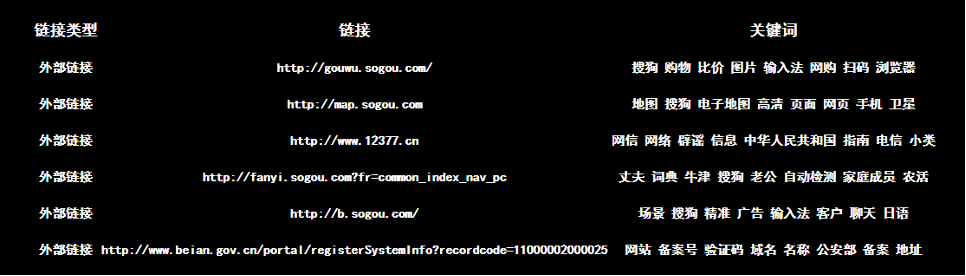

# README

## Introduction

This is a full-stack Web Crawler web application whose back-end is developedd by Python and front-end is developed by HTML and CSS. The main features of his Web Crawler includes:

- Crawling a specific URL got from the user
- Extracting and storing information efficiently
- A complete databasr storage function and log system
- Crawling all web pages and keywords under a certain domain name
- URL classification: internal, external and IPC. Also can avoid scanning duplicate pages

### System Design

For this project, we used the `browser/server architecture mode (b/s mode)`. The user-tier is constituted by the browser and webpages. The web server in the middle-tier is Flask and it will generate HTML statically. This first two tier is connected via HTTP. The data-tier is made up by database and log.

### Storage

We use database and log file to store the data. When the application is crawling, the data will be stored to the database first. The database is not only used to store the information but also used to avoid scanning duplication.  
After the scrawling is finished, the results will be export and stored into a .log file as a long-term storage.  

## Preview

### The Input Field

  

### The Result Field

  

## Installation

If you want to run this application, install Python environment in your local machine first. Then download this repository and run the NS_main.py file in your Python IDE.
